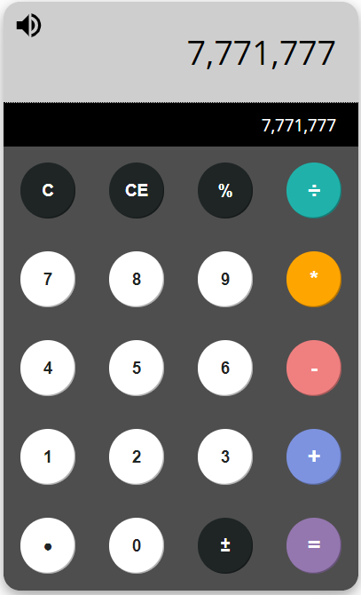

# Calculator ReactJS

This is a simple arithmetic calculator built with REACT.JS library. 

Live version deployed at [heroku](https://gen2wind-calc.herokuapp.com//)

To run it on your local machine clone into the repo, then type: 

    npm install && npm start
     
     OR
    yarn install && yarn start 
    
    
An Image of how it looks: 

